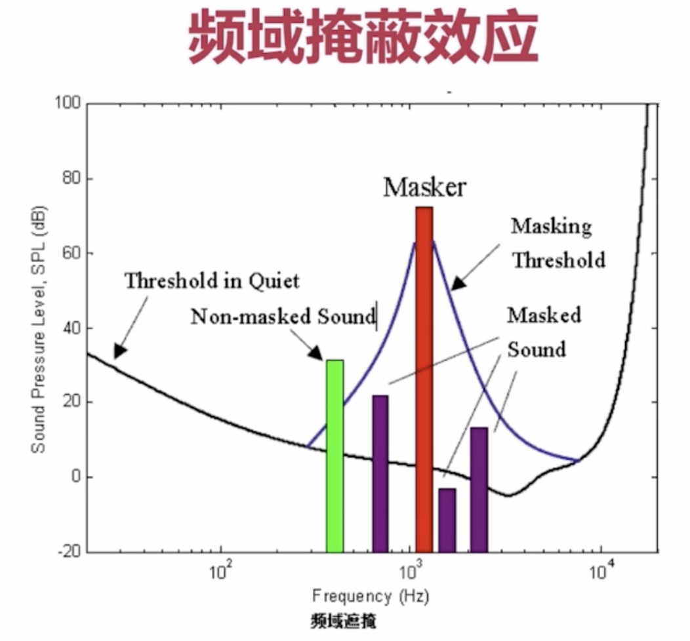
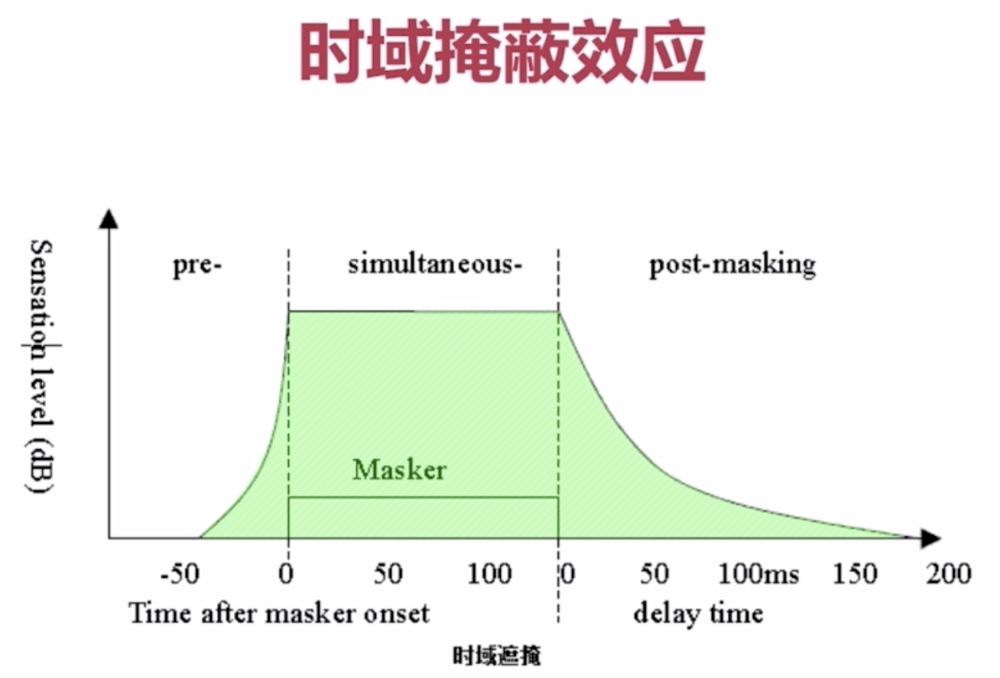
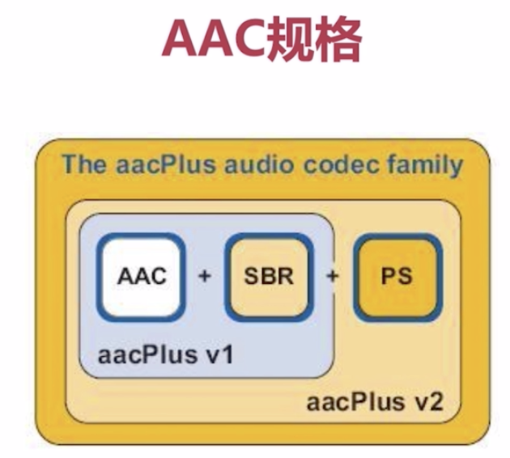

## 直播构架

### 泛娱乐化直播

#### CDN网络
为了解决访问资源慢而出现的技术，慢的原因：

- 链路过长。
- 人为因素，运营商限制等。

##### 边缘节点
用户从边缘节点获取数据。

##### 二级节点
主干网节点，主要用于缓存，减轻源站压力

##### 源站
CP（内容提供方）将内容放到源站

### 实时互动直播

=================================================

### 音频
- 三要素：频率，响度，波形。

#### 量化过程
- 模拟数据，采样，量化，编码（10进制到2进制），数字信号

#### 量化基本概念
- 采样大小：一个采样用多少bit存放，常用16bit。
- 采样率：采样频率 8k，16k，32k，44.1k，48k。
- 声道数：单声道，双声道，多声道。

#### 码率计算
- 音频流码率：采样率 x 采样大小 x 声道数

例如：采样率44.1KHz，采样大小16bit，双声道PCM编码WAV文件码率为：44.1K*16*2=1411.2Kb/s。大约176KB/s，对音频来说比较大。

#### 音频压缩
- 消除冗余数据，有损压缩，去掉人耳听觉范围之外的，或者被遮蔽的音频信号。信号遮蔽包括频域遮蔽和时域遮蔽。
    - 频域遮蔽是指同样（或靠近）的频率，声音大会遮蔽声音小的。
    
    - 时域遮蔽是指一段时间内，声音大的会遮蔽声音小的。
    
- 哈夫曼无损编码。

#### 音频编码器
- 常见音频编码器：OPUS, AAC, Vorbis, Speex, iLBC, AMR, G.711.
- OPUS > ACC > Vorbis
- AAC(Advanced Audio Coding)目的是为了取代mp3（应用mpeg-2标准）。AAC使用mpeg-4标准，加入SBR和PS技术。
- AAC规格有AAC LC, AAC HE V1, AAC HE V2.
    
    - AAC LC: (Low Complexity)低复杂度，码流128k。
    - AAC HE: AAC LC + SBR (Spectral Band Replication)分频复用。
    - AAC HE V2: AAC LC + SBR + PS (Parametric Stereo)。
- AAC格式
    - ADIF (Audio Data Interchange Format) 这种格式只能从开头解码。
    - ADTS (Audio Data Transport Stream) 每个音频帧都加了一个同步字，可以在音频流任何位置开始解码。

### 视频

#### H264概念
- I帧：关键帧，采用帧内压缩技术。对于变化较小的几个帧，保存的第一帧。
- P帧：向前参考帧，压缩时只参考前一帧，保存的是与前一帧的差异，属于帧间压缩技术。
- B帧：双向参考帧，压缩时及参考前一帧，也参考后一帧，帧间压缩技术。
- GOF：一组帧，I帧与I帧之间的一组。
- SPS：Sequence Parameter Set, 序列参数集。
- PPS: Picture Parameter Set, 图像参数集。
- 花屏和卡顿，GOF中P帧丢失造成图像解码错误。为了避免花屏，一般P帧或者I帧丢失，则去掉GOF中所有帧，知道下一个I帧来到，这就是卡顿。

#### 视频编码器
- x264/x265
- openH264
- vp8/vp9

#### H264压缩技术
- 帧内预测压缩，解决空域冗余数据。
- 帧间预测压缩，解决时域冗余数据。
- 整数离散余弦变换（DCT）。
- CABAC压缩。

